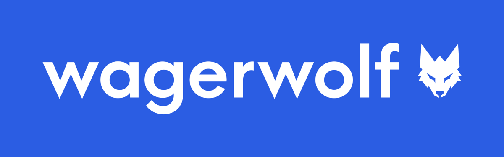
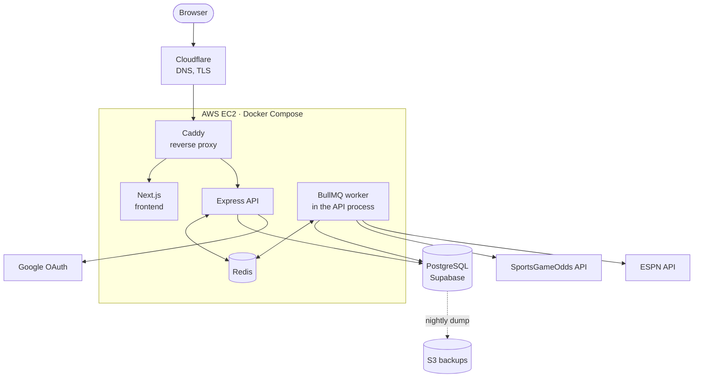

  

  Play at <a href="https://wagerwolf.app">wagerwolf.app</a>. Health at <a href="https://api.wagerwolf.app/health">api.wagerwolf.app/health</a>.

---

## Overview

Wagerwolf is a fantasy football platform built around a sportsbook. Instead of
drafting and managing a roster, players wager virtual currency on real NFL
markets and compete head-to-head throughout the season. Like a standard
fantasy league, everything runs automatically. Wagerwolf does not support
mobile right now.

1. **Join a league.** Get matched into a league by start week, size,
   and level, or join friends with an invite code.
2. **Get your bankroll.** Every player receives the same allowance at the
   start of each NFL week.
3. **Place bets.** Stake it on player props, game lines, and parlays until
   each game kicks off.
4. **Win matchups.** Each week you face one leaguemate head-to-head, and
   whoever finishes with the higher balance wins.
5. **Make the playoffs.** The top teams in the standings are seeded into a
   playoff bracket after the regular season.
6. **Win the championship.** The bracket advances week by week until the
   league crowns a champion.

## Tech Stack

<table>
  <tr><td><b>Frontend</b></td><td>Next.js, React</td></tr>
  <tr><td><b>Backend</b></td><td>Node.js, Express, Drizzle ORM, PostgreSQL (Supabase), Redis, BullMQ</td></tr>
  <tr><td><b>Infrastructure</b></td><td>AWS, Terraform, Docker, Caddy, Cloudflare, GitHub Actions</td></tr>
  <tr><td><b>Integrations</b></td><td>SportsGameOdds API, ESPN API, Google OAuth</td></tr>
</table>

## System Architecture

## Technical Design

### Background Jobs & Data Pipeline

- **Job orchestration:** BullMQ workers on Redis handle data sync, odds
  polling, live scores, bet settlement, and weekly bankroll resets.
- **Deduplicated scheduling:** idempotent job registration prevents
  duplicate runs across API replicas.
- **Transactional retries:** bankroll resets and their completion flags
  commit in one transaction, making retries safe.
- **API quota optimization:** adaptive SportsGameOdds polling based on
  kickoff time, reducing worst-case usage from 96% to 74% of the monthly
  quota.

### Concurrency & Data Integrity

- **Race-free writes:** atomic conditional SQL updates prevent leagues from
  exceeding capacity under concurrent joins.
- **Data minimization:** queries for other users select only public columns.

### Infrastructure & CI/CD

- **Infrastructure as Code:** Terraform provisions AWS EC2, S3, and IAM;
  Docker Compose runs the frontend, API, and Redis.
- **Continuous integration:** GitHub Actions runs typechecking, linting, and
  builds on every push.
- **Continuous deployment:** release tags trigger image builds and deploys,
  with automatic rollback on failed health checks.
- **Backups:** nightly database backups to S3 via a least-privilege IAM role,
  with no stored credentials.

### Security

- **OAuth 2.0:** custom Google sign-in flow with CSRF protection via
  single-use `state` tokens.
- **Rate limiting:** Redis-backed and shared across instances.

## Data Sources

- **[SportsGameOdds](https://sportsgameodds.com):** odds for player props and
  game lines, and the prop results used to grade them.
- **ESPN:** schedules, live scores, box scores, and player and team data, from
  ESPN's public endpoints.

## License

All rights reserved. The source is public to read but not licensed for reuse.
Wagerwolf is a free game played with virtual currency. It is not a sportsbook,
takes no deposits, and pays no winnings. Team names and logos belong to their
owners and are used only to identify teams.
